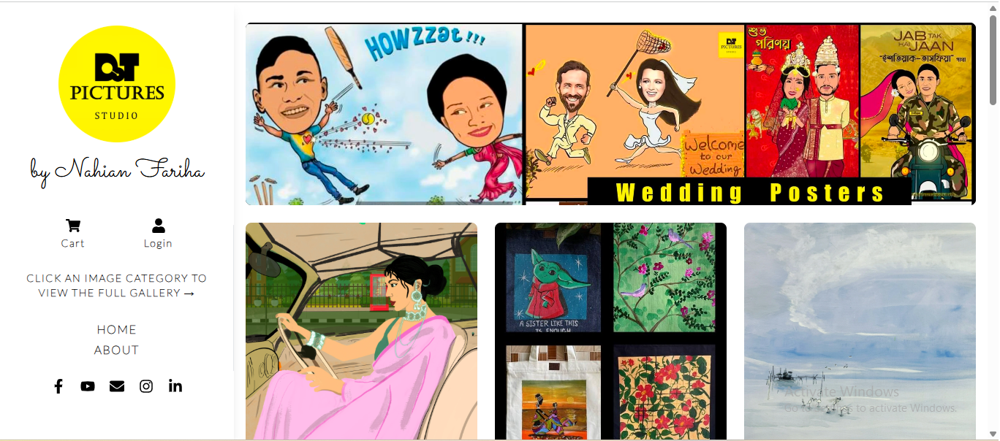

# Dot Pictures Studio 🎨🖼️


[](https://react.dev/)
[](https://vitejs.dev/)
[](https://developer.mozilla.org/en-US/docs/Web/JavaScript)
[](https://tailwindcss.com/)
[](https://flowbite-react.com/)

---

<p align="center">
  
</p>
## 📌 Overview


Developed a fully responsive web application for my arts and graphic business that helps me showcase and manage my work online, built with React, Tailwind CSS, and Node.js using Vite for modern, efficient deployment.


This project demonstrates skills in:
- Responsive web design  
- Interactive UI development  
- State-of-the-art frontend tooling  
- Component-driven architecture  

---

## 🚀 Live Demo

You can visit the live deployed version here:  
(https://nahianfariha.github.io/dotpicturesstudio/)

You can deploy this project using services like:

Netlify
Vercel
GitHub Pages
Firebase Hosting

Just make sure to point to the production build in the dist/ folder.
---

## 💡 Features

- ✨ Clean, modern UI layout  
- 🖼️ Image galleries and portfolio sections  
- 📱 Fully responsive for desktop, tablet, and mobile  
- ⚡ Fast performance with optimized assets  
- 💻 Built with scalable frontend architecture

---

## 🛠️ Tech Stack

This project uses the following technologies:

```markdown
- **JavaScript / TypeScript** – Core scripting language
- **React** – Component-based UI framework
- **Vite** – Fast development and build tooling
- **Tailwind CSS** – Utility-first styling
- **Flowbite-React** – UI component library


